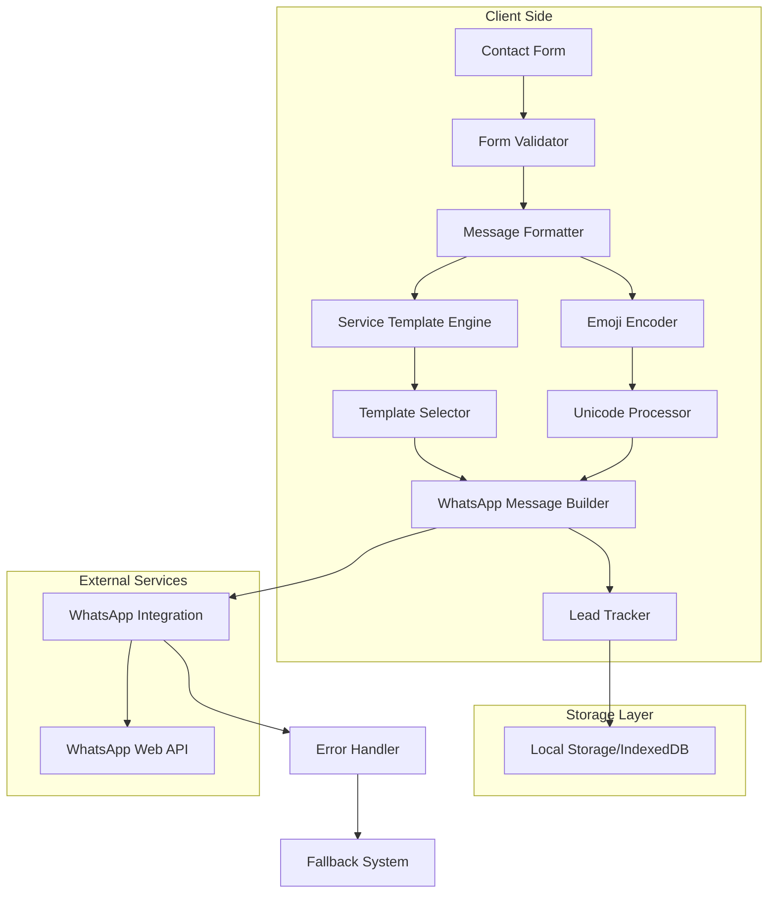

# Design Document: ProAir Zimbabwe Booking System Enhancement

## Overview

The ProAir Zimbabwe booking system enhancement addresses critical issues with the current WhatsApp contact form integration while introducing comprehensive lead management capabilities. The system currently suffers from emoji encoding problems that render messages unprofessional (displaying � characters instead of emojis) and lacks essential business workflow features for effective lead tracking and management.

This design provides a robust solution that ensures proper Unicode handling, implements structured message formatting, introduces a lead tracking system, and enhances the overall customer-to-business communication workflow through WhatsApp integration.

### Key Design Goals

- **Unicode Compatibility**: Ensure all emojis display correctly across WhatsApp platforms
- **Professional Messaging**: Implement structured, business-ready message formatting
- **Lead Management**: Introduce comprehensive lead tracking and status management
- **Service Optimization**: Provide service-specific message templates and workflows
- **Error Resilience**: Implement robust error handling and fallback mechanisms
- **Multi-Platform Support**: Ensure consistent functionality across all WhatsApp clients

## Architecture

### System Architecture Overview



### Component Interaction Flow

1. **Form Submission**: User submits contact form with service selection
2. **Validation**: Client-side validation ensures data integrity
3. **Service Processing**: Service-specific templates are selected and populated
4. **Message Formatting**: Professional message structure is applied
5. **Emoji Encoding**: Unicode processing ensures cross-platform compatibility
6. **Lead Generation**: Unique reference number is generated and stored
7. **WhatsApp Integration**: Formatted message is sent via WhatsApp
8. **Error Handling**: Fallback mechanisms activate if primary flow fails

## Components and Interfaces

### Core Components

#### 1. EmojiEncoder Class
```javascript
class EmojiEncoder {
  static encode(text: string): string
  static getUnicodeSequence(emoji: string): string
  static validateCompatibility(emoji: string): boolean
  static getFallbackSymbol(emoji: string): string
}
```

**Responsibilities:**
- Convert emoji characters to Unicode escape sequences
- Validate emoji compatibility across WhatsApp platforms
- Provide text-based fallbacks for unsupported emojis
- Handle encoding errors gracefully

#### 2. MessageFormatter Class
```javascript
class MessageFormatter {
  static formatEnquiry(leadData: LeadData): string
  static applyServiceTemplate(service: string, data: FormData): string
  static addBusinessMetadata(message: string, leadId: string): string
  static formatContactInfo(contactData: ContactData): string
}
```

**Responsibilities:**
- Structure messages with consistent formatting
- Apply service-specific templates
- Include business workflow elements (timestamps, reference numbers)
- Format contact information for easy extraction

#### 3. LeadTracker Class
```javascript
class LeadTracker {
  static generateLeadId(): string
  static storeLead(leadData: LeadData): void
  static updateLeadStatus(leadId: string, status: LeadStatus): void
  static getLeadHistory(): LeadData[]
  static exportLeads(): string
}
```

**Responsibilities:**
- Generate unique lead reference numbers
- Store lead data in local storage
- Track lead status changes
- Provide lead management interface

#### 4. ServiceTemplateEngine Class
```javascript
class ServiceTemplateEngine {
  static getTemplate(serviceType: string): MessageTemplate
  static populateTemplate(template: MessageTemplate, data: FormData): string
  static getServiceQuestions(serviceType: string): Question[]
  static formatServiceSpecificData(service: string, data: any): string
}
```

**Responsibilities:**
- Manage service-specific message templates
- Generate appropriate questions for each service type
- Format service-specific information
- Provide service categorization

#### 5. ErrorHandler Class
```javascript
class ErrorHandler {
  static handleWhatsAppError(error: Error): void
  static provideFallbackOptions(): FallbackOption[]
  static logError(error: Error, context: string): void
  static showUserFriendlyMessage(errorType: string): void
}
```

**Responsibilities:**
- Handle WhatsApp integration failures
- Provide alternative contact methods
- Log errors for debugging
- Display user-friendly error messages

### Interface Definitions

#### LeadData Interface
```typescript
interface LeadData {
  id: string;
  timestamp: Date;
  name: string;
  email: string;
  phone: string;
  service: string;
  message: string;
  status: LeadStatus;
  priority: Priority;
  source: string;
}
```

#### MessageTemplate Interface
```typescript
interface MessageTemplate {
  header: string;
  serviceIcon: string;
  questions: Question[];
  footer: string;
  urgencyLevel: Priority;
}
```

#### ContactData Interface
```typescript
interface ContactData {
  name: string;
  email: string;
  phone: string;
  preferredContact?: string;
}
```

## Data Models

### Lead Management Schema

#### Lead Entity
```typescript
type LeadStatus = 'new' | 'contacted' | 'quoted' | 'won' | 'lost';
type Priority = 'low' | 'normal' | 'high' | 'urgent';

interface Lead {
  // Core identification
  id: string;                    // Format: PA-YYYYMMDD-XXXX
  timestamp: Date;
  
  // Customer information
  customer: {
    name: string;
    email: string;
    phone: string;
    preferredContact?: 'phone' | 'email' | 'whatsapp';
  };
  
  // Service details
  service: {
    type: string;
    category: ServiceCategory;
    urgency: Priority;
    specificRequirements?: string;
  };
  
  // Business workflow
  status: LeadStatus;
  assignedTo?: string;
  notes: string[];
  followUpDate?: Date;
  
  // Tracking
  source: 'website' | 'referral' | 'social';
  messagesSent: number;
  lastContact?: Date;
}
```

#### Service Categories
```typescript
enum ServiceCategory {
  CAR_AC = 'car-ac',
  HOME_HEATING_COOLING = 'home-heating-cooling',
  OFFICE_CLIMATE = 'office-climate',
  PORTABLE_HIRE = 'portable-hire',
  GAS_HEATER_HIRE = 'gas-heater-hire',
  WHIRLYBIRD = 'whirlybird',
  EXTRACTOR_FAN = 'extractor-fan',
  GENERAL = 'general'
}
```

### Message Structure Schema

#### WhatsApp Message Format
```typescript
interface WhatsAppMessage {
  header: {
    businessName: string;
    messageType: string;
    leadReference: string;
  };
  
  customerInfo: {
    name: string;
    email: string;
    phone: string;
    preferredContact?: string;
  };
  
  serviceDetails: {
    type: string;
    category: ServiceCategory;
    urgency: Priority;
    specificInfo?: ServiceSpecificData;
  };
  
  message: {
    content: string;
    timestamp: Date;
  };
  
  businessActions: {
    quickResponses: string[];
    followUpReminders: string[];
  };
  
  footer: {
    source: string;
    businessHours: string;
    emergencyContact?: string;
  };
}
```

### Storage Implementation

#### Local Storage Structure
```typescript
interface StorageSchema {
  leads: {
    [leadId: string]: Lead;
  };
  
  settings: {
    whatsappNumber: string;
    businessHours: string;
    autoResponses: boolean;
    leadNotifications: boolean;
  };
  
  templates: {
    [serviceType: string]: MessageTemplate;
  };
  
  analytics: {
    totalLeads: number;
    conversionRate: number;
    averageResponseTime: number;
    lastExport: Date;
  };
}
```

## Implementation Details

### Emoji Encoding Strategy

#### Unicode Handling Approach
The emoji encoding issue stems from improper Unicode handling in the current WhatsApp message construction. The solution implements a comprehensive Unicode processing system:

1. **Character Detection**: Identify emoji characters in message strings
2. **Unicode Conversion**: Convert emojis to proper Unicode escape sequences
3. **Platform Validation**: Ensure compatibility across WhatsApp Web, iOS, and Android
4. **Fallback Mechanism**: Provide text alternatives for unsupported characters

#### Supported Emoji Set
```typescript
const WHATSAPP_SAFE_EMOJIS = {
  // Business communication
  '🔵': '\\u{1F535}',  // Blue circle for headers
  '👤': '\\u{1F464}',  // Person for customer info
  '📧': '\\u{1F4E7}',  // Email symbol
  '📱': '\\u{1F4F1}',  // Mobile phone
  '🔧': '\\u{1F527}',  // Wrench for services
  '💬': '\\u{1F4AC}',  // Speech bubble for messages
  '⏰': '\\u{23F0}',   // Clock for timestamps
  '🏠': '\\u{1F3E0}',  // House for home services
  '🚗': '\\u{1F697}',  // Car for automotive services
  '🏢': '\\u{1F3E2}',  // Office building
  
  // Fallback symbols
  FALLBACKS: {
    '🔵': '•',
    '👤': 'Name:',
    '📧': 'Email:',
    '📱': 'Phone:',
    '🔧': 'Service:',
    '💬': 'Message:',
    '⏰': 'Time:',
    '🏠': 'Home:',
    '🚗': 'Car:',
    '🏢': 'Office:'
  }
};
```

### Message Template System

#### Service-Specific Templates

**Car A/C Service Template**
```typescript
const CAR_AC_TEMPLATE = {
  header: "🚗 *ProAir Zimbabwe — Car A/C Enquiry*",
  serviceQuestions: [
    "Vehicle Make & Model:",
    "Year of Manufacture:",
    "Current Symptoms:",
    "Last Service Date:",
    "Preferred Appointment Time:"
  ],
  urgencyIndicators: {
    "no cooling": "🔴 URGENT",
    "strange noise": "🟡 PRIORITY",
    "regular service": "🟢 ROUTINE"
  },
  businessActions: [
    "📞 Call customer",
    "📋 Prepare quote",
    "📅 Schedule appointment",
    "🔧 Check parts availability"
  ]
};
```

**Home/Office Climate Template**
```typescript
const CLIMATE_CONTROL_TEMPLATE = {
  header: "🏠 *ProAir Zimbabwe — Climate Control Enquiry*",
  serviceQuestions: [
    "Property Type:",
    "Room/Area Size:",
    "Current System:",
    "Installation Timeline:",
    "Budget Range:"
  ],
  siteVisitRequired: true,
  businessActions: [
    "📍 Schedule site visit",
    "📐 Prepare measurement tools",
    "💰 Calculate quote",
    "📋 Check installation schedule"
  ]
};
```

#### Dynamic Template Selection
```typescript
class TemplateSelector {
  static selectTemplate(serviceType: string, customerData: any): MessageTemplate {
    const baseTemplate = SERVICE_TEMPLATES[serviceType] || GENERAL_TEMPLATE;
    
    // Add urgency indicators
    if (this.detectUrgency(customerData.message)) {
      baseTemplate.priority = 'urgent';
      baseTemplate.header = '🔴 ' + baseTemplate.header;
    }
    
    // Add business hours context
    if (this.isOutOfHours()) {
      baseTemplate.footer += '\n⏰ *Next business day response expected*';
    }
    
    return baseTemplate;
  }
  
  static detectUrgency(message: string): boolean {
    const urgentKeywords = ['emergency', 'urgent', 'broken', 'not working', 'no cooling', 'no heating'];
    return urgentKeywords.some(keyword => 
      message.toLowerCase().includes(keyword)
    );
  }
}
```

### Lead Tracking Implementation

#### Lead ID Generation
```typescript
class LeadIdGenerator {
  static generate(): string {
    const date = new Date();
    const dateStr = date.toISOString().slice(0, 10).replace(/-/g, '');
    const sequence = this.getNextSequence(dateStr);
    return `PA-${dateStr}-${sequence.toString().padStart(4, '0')}`;
  }
  
  private static getNextSequence(date: string): number {
    const key = `lead_sequence_${date}`;
    const current = parseInt(localStorage.getItem(key) || '0');
    const next = current + 1;
    localStorage.setItem(key, next.toString());
    return next;
  }
}
```

#### Lead Status Management
```typescript
class LeadStatusManager {
  static updateStatus(leadId: string, newStatus: LeadStatus, notes?: string): void {
    const lead = this.getLead(leadId);
    if (!lead) throw new Error(`Lead ${leadId} not found`);
    
    const statusChange = {
      from: lead.status,
      to: newStatus,
      timestamp: new Date(),
      notes: notes || ''
    };
    
    lead.status = newStatus;
    lead.statusHistory = lead.statusHistory || [];
    lead.statusHistory.push(statusChange);
    
    this.saveLead(lead);
    this.notifyStatusChange(leadId, statusChange);
  }
  
  static getLeadsByStatus(status: LeadStatus): Lead[] {
    return this.getAllLeads().filter(lead => lead.status === status);
  }
}
```

### WhatsApp Integration Enhancement

#### Message Construction
```typescript
class WhatsAppMessageBuilder {
  static buildEnquiryMessage(leadData: LeadData): string {
    const template = TemplateSelector.selectTemplate(leadData.service.type, leadData);
    const encodedEmojis = EmojiEncoder.encodeMessage(template.header);
    
    let message = `${encodedEmojis}\n`;
    message += `━━━━━━━━━━━━━━━━━━\n\n`;
    
    // Customer information section
    message += `👤 *Customer Details:*\n`;
    message += `Name: ${leadData.customer.name}\n`;
    message += `📧 Email: ${leadData.customer.email}\n`;
    message += `📱 Phone: ${leadData.customer.phone}\n`;
    if (leadData.customer.preferredContact) {
      message += `Preferred Contact: ${leadData.customer.preferredContact}\n`;
    }
    message += `\n`;
    
    // Service information section
    message += `🔧 *Service Details:*\n`;
    message += `Type: ${leadData.service.type}\n`;
    message += `Category: ${leadData.service.category}\n`;
    message += `Priority: ${this.formatPriority(leadData.service.urgency)}\n`;
    message += `\n`;
    
    // Customer message section
    message += `💬 *Customer Message:*\n`;
    message += `${leadData.message}\n\n`;
    
    // Business workflow section
    message += `📋 *Lead Information:*\n`;
    message += `Reference: ${leadData.id}\n`;
    message += `Submitted: ${leadData.timestamp.toLocaleString()}\n`;
    message += `Source: Website Contact Form\n\n`;
    
    // Quick actions section
    message += `⚡ *Quick Actions:*\n`;
    template.businessActions.forEach(action => {
      message += `• ${action}\n`;
    });
    
    message += `\n━━━━━━━━━━━━━━━━━━\n`;
    message += `_ProAir Zimbabwe Lead Management System_`;
    
    return EmojiEncoder.encodeMessage(message);
  }
  
  private static formatPriority(priority: Priority): string {
    const priorityMap = {
      'low': '🟢 Low',
      'normal': '🟡 Normal', 
      'high': '🟠 High',
      'urgent': '🔴 URGENT'
    };
    return priorityMap[priority] || '🟡 Normal';
  }
}
```

#### Error Handling and Fallbacks
```typescript
class WhatsAppErrorHandler {
  static async sendMessage(message: string, phoneNumber: string): Promise<boolean> {
    try {
      const whatsappUrl = `https://wa.me/${phoneNumber}?text=${encodeURIComponent(message)}`;
      
      // Attempt to open WhatsApp
      const opened = window.open(whatsappUrl, '_blank');
      
      if (!opened) {
        throw new Error('Popup blocked or WhatsApp unavailable');
      }
      
      return true;
    } catch (error) {
      this.handleError(error, message);
      return false;
    }
  }
  
  static handleError(error: Error, originalMessage: string): void {
    console.error('WhatsApp integration error:', error);
    
    // Show fallback options to user
    this.showFallbackDialog({
      title: 'WhatsApp Unavailable',
      message: 'We couldn\'t open WhatsApp automatically. Please choose an alternative:',
      options: [
        {
          label: 'Copy Message & Open WhatsApp',
          action: () => this.copyAndRedirect(originalMessage)
        },
        {
          label: 'Call Directly',
          action: () => window.open('tel:+263779840840')
        },
        {
          label: 'Send Email',
          action: () => this.composeEmail(originalMessage)
        }
      ]
    });
  }
  
  static copyAndRedirect(message: string): void {
    navigator.clipboard.writeText(message).then(() => {
      alert('Message copied to clipboard. Opening WhatsApp...');
      window.open('https://wa.me/263779840840', '_blank');
    });
  }
}
```
## Correctness Properties

*A property is a characteristic or behavior that should hold true across all valid executions of a system-essentially, a formal statement about what the system should do. Properties serve as the bridge between human-readable specifications and machine-verifiable correctness guarantees.*

After analyzing the acceptance criteria, I identified several properties that can be consolidated to eliminate redundancy:

**Property Reflection:**
- Properties 1.1 and 1.2 both test emoji encoding - combined into Property 1
- Properties 2.1 and 7.2 both test message structure - combined into Property 2  
- Properties 2.2 and 7.1 both test formatting consistency - combined into Property 3
- Properties 4.1, 4.2, and 4.3 all test service-specific templates - combined into Property 8
- Properties 7.3 and 7.4 both test contact information formatting - combined into Property 15
- Properties 8.2 and 8.3 both test cross-platform compatibility - combined into Property 18

### Property 1: Emoji Unicode Encoding
*For any* message containing emoji characters, the Message_Formatter should convert all emojis to proper Unicode escape sequences that are compatible with WhatsApp platforms.

**Validates: Requirements 1.1, 1.2**

### Property 2: Message Structure Consistency  
*For any* customer enquiry data, the Message_Formatter should structure messages with clearly separated sections for contact details, service information, and customer message content.

**Validates: Requirements 2.1, 7.2**

### Property 3: Formatting Consistency
*For any* set of customer enquiries, the Message_Formatter should apply consistent labeling, spacing, and data formatting across all generated messages.

**Validates: Requirements 2.2, 7.1**

### Property 4: Emoji Compatibility Validation
*For any* emoji used in message formatting, the system should only use emojis from the approved WhatsApp-compatible set.

**Validates: Requirements 1.4**

### Property 5: Emoji Fallback Handling
*For any* emoji encoding failure, the system should substitute appropriate text-based symbols instead of displaying question mark characters.

**Validates: Requirements 1.3, 1.5**

### Property 6: Timestamp Inclusion
*For any* formatted message, the Message_Formatter should include a properly formatted timestamp indicating when the enquiry was submitted.

**Validates: Requirements 2.3**

### Property 7: Urgency Detection and Marking
*For any* customer message containing urgent keywords (emergency, broken, not working), the Message_Formatter should add appropriate urgency indicators to the formatted output.

**Validates: Requirements 2.4**

### Property 8: Service-Specific Template Selection
*For any* selected service type (Car A/C, Home/Office, Portable Hire), the Message_Formatter should include the appropriate service-specific questions and formatting elements.

**Validates: Requirements 4.1, 4.2, 4.3**

### Property 9: Lead ID Generation Uniqueness
*For any* sequence of lead submissions, the Lead_Tracker should generate unique reference numbers that follow the format PA-YYYYMMDD-XXXX.

**Validates: Requirements 3.1**

### Property 10: Lead Reference Inclusion
*For any* generated lead, the formatted WhatsApp message should contain the lead's unique reference number.

**Validates: Requirements 3.2**

### Property 11: Lead Status Management
*For any* valid lead status change (contacted, quoted, won, lost), the Lead_Tracker should update the lead status and record the change with a timestamp.

**Validates: Requirements 3.3, 3.4**

### Property 12: Service Icon Assignment
*For any* service category, the Message_Formatter should include the appropriate service-specific icon or identifier for visual recognition.

**Validates: Requirements 4.4**

### Property 13: Default Service Categorization
*For any* enquiry without a specified service selection, the Message_Formatter should categorize it as "General Enquiry" with standard formatting.

**Validates: Requirements 4.5**

### Property 14: Business Workflow Integration
*For any* formatted message, the system should include pre-formatted response templates and quick action items for business team workflow.

**Validates: Requirements 5.1, 5.4**

### Property 15: Contact Information Formatting
*For any* customer contact data, the Message_Formatter should format phone numbers as clickable tel: links and email addresses in a copyable format.

**Validates: Requirements 5.3, 7.3, 7.4**

### Property 16: WhatsApp Error Handling
*For any* WhatsApp integration failure, the system should display appropriate error messages and provide alternative contact options (phone, email).

**Validates: Requirements 6.1, 6.2**

### Property 17: Error Logging and Recovery
*For any* failed message attempt, the system should log the failure and provide retry mechanisms or simplified text-only alternatives.

**Validates: Requirements 6.3, 6.4, 6.5**

### Property 18: Cross-Platform Compatibility
*For any* generated message, the formatting should maintain consistency and functionality across WhatsApp Web, iOS, and Android platforms.

**Validates: Requirements 8.2, 8.3, 8.4**

### Property 19: Preferred Contact Method Inclusion
*For any* customer data that includes a preferred contact method, the Message_Formatter should include this information in the formatted message.

**Validates: Requirements 2.5**

### Property 20: Business System Integration
*For any* service selection, the Message_Formatter should include service codes or categories that match internal business systems for easy data extraction.

**Validates: Requirements 7.5**

## Error Handling

### Error Categories and Responses

#### 1. Emoji Encoding Errors
- **Detection**: Invalid Unicode sequences or unsupported emoji characters
- **Response**: Automatic fallback to text-based symbols
- **Logging**: Record failed emoji with context for future whitelist updates
- **User Impact**: Transparent - user sees text symbols instead of broken emojis

#### 2. WhatsApp Integration Failures
- **Detection**: Popup blocking, WhatsApp unavailable, or network issues
- **Response**: Display fallback dialog with alternative contact methods
- **Logging**: Record failure type, timestamp, and user agent for debugging
- **User Impact**: Guided to alternative contact methods (phone, email, manual WhatsApp)

#### 3. Lead Storage Failures
- **Detection**: Local storage quota exceeded or browser restrictions
- **Response**: Attempt IndexedDB fallback, then in-memory storage
- **Logging**: Record storage method used and any limitations
- **User Impact**: Lead tracking may be session-only if persistent storage fails

#### 4. Message Formatting Errors
- **Detection**: Template parsing failures or missing required data
- **Response**: Generate simplified text-only message with core information
- **Logging**: Record template name and missing data fields
- **User Impact**: Message sent with basic formatting instead of enhanced layout

#### 5. Service Template Errors
- **Detection**: Unknown service type or missing template configuration
- **Response**: Fall back to general enquiry template
- **Logging**: Record unknown service type for template creation
- **User Impact**: Generic formatting instead of service-specific enhancements

### Error Recovery Mechanisms

#### Graceful Degradation Strategy
```typescript
class ErrorRecoveryManager {
  static handleFormattingError(error: Error, leadData: LeadData): string {
    console.warn('Message formatting failed, using simplified format:', error);
    
    // Generate basic text-only message
    return `ProAir Zimbabwe - New Enquiry
    
Name: ${leadData.customer.name}
Email: ${leadData.customer.email}  
Phone: ${leadData.customer.phone}
Service: ${leadData.service.type}
Message: ${leadData.message}
Reference: ${leadData.id}
Time: ${leadData.timestamp.toLocaleString()}

Sent from proairzw.co.zw`;
  }
  
  static handleStorageError(error: Error, leadData: LeadData): void {
    console.warn('Lead storage failed, attempting fallback:', error);
    
    // Try IndexedDB if localStorage failed
    if (error.name === 'QuotaExceededError') {
      IndexedDBManager.storeLead(leadData);
    } else {
      // Store in session memory as last resort
      SessionLeadManager.storeLead(leadData);
    }
  }
}
```

#### Retry Logic Implementation
```typescript
class RetryManager {
  static async retryWithBackoff<T>(
    operation: () => Promise<T>, 
    maxRetries: number = 3,
    baseDelay: number = 1000
  ): Promise<T> {
    for (let attempt = 1; attempt <= maxRetries; attempt++) {
      try {
        return await operation();
      } catch (error) {
        if (attempt === maxRetries) throw error;
        
        const delay = baseDelay * Math.pow(2, attempt - 1);
        await new Promise(resolve => setTimeout(resolve, delay));
      }
    }
    throw new Error('Max retries exceeded');
  }
}
```

## Testing Strategy

### Dual Testing Approach

The testing strategy employs both unit testing and property-based testing to ensure comprehensive coverage:

**Unit Tests** focus on:
- Specific examples and edge cases
- Integration points between components  
- Error conditions and fallback mechanisms
- User interface interactions

**Property Tests** focus on:
- Universal properties that hold for all inputs
- Comprehensive input coverage through randomization
- Business rule validation across all scenarios
- Cross-platform compatibility verification

### Property-Based Testing Configuration

**Testing Library**: Fast-check (JavaScript property-based testing library)
**Test Configuration**: Minimum 100 iterations per property test
**Tagging Format**: Each test references its design document property

#### Example Property Test Implementation
```typescript
import fc from 'fast-check';

describe('Message Formatting Properties', () => {
  test('Property 1: Emoji Unicode Encoding', () => {
    // Feature: booking-system-enhancement, Property 1: Emoji Unicode Encoding
    fc.assert(fc.property(
      fc.record({
        name: fc.string(),
        message: fc.string().filter(s => /[\u{1F600}-\u{1F64F}]|[\u{1F300}-\u{1F5FF}]|[\u{1F680}-\u{1F6FF}]|[\u{2600}-\u{26FF}]/u.test(s))
      }),
      (data) => {
        const formatted = MessageFormatter.formatEnquiry(data);
        // Should not contain raw emoji characters
        expect(formatted).not.toMatch(/[\u{1F600}-\u{1F64F}]|[\u{1F300}-\u{1F5FF}]|[\u{1F680}-\u{1F6FF}]|[\u{2600}-\u{26FF}]/u);
        // Should contain Unicode escape sequences
        expect(formatted).toMatch(/\\u\{[0-9A-F]+\}/);
      }
    ), { numRuns: 100 });
  });

  test('Property 9: Lead ID Generation Uniqueness', () => {
    // Feature: booking-system-enhancement, Property 9: Lead ID Generation Uniqueness  
    fc.assert(fc.property(
      fc.integer({ min: 1, max: 1000 }),
      (count) => {
        const leadIds = Array.from({ length: count }, () => LeadIdGenerator.generate());
        const uniqueIds = new Set(leadIds);
        expect(uniqueIds.size).toBe(leadIds.length);
        
        // Verify format PA-YYYYMMDD-XXXX
        leadIds.forEach(id => {
          expect(id).toMatch(/^PA-\d{8}-\d{4}$/);
        });
      }
    ), { numRuns: 100 });
  });
});
```

### Unit Testing Strategy

**Testing Framework**: Jest with DOM testing utilities
**Coverage Requirements**: Minimum 90% code coverage
**Focus Areas**:

1. **Component Integration Tests**
   - Form submission workflow
   - WhatsApp message generation
   - Lead storage and retrieval
   - Error handling pathways

2. **Edge Case Testing**
   - Empty form submissions
   - Invalid email formats
   - Extremely long messages
   - Special characters in names
   - Network connectivity issues

3. **User Interface Tests**
   - Form validation feedback
   - Success message display
   - Error message presentation
   - Fallback option visibility

#### Example Unit Test Implementation
```typescript
describe('Contact Form Integration', () => {
  test('should handle empty service selection with default categorization', () => {
    const formData = {
      name: 'John Doe',
      email: 'john@example.com',
      phone: '0779123456',
      service: '', // Empty service
      message: 'Need help with air conditioning'
    };
    
    const formatted = MessageFormatter.formatEnquiry(formData);
    expect(formatted).toContain('General Enquiry');
    expect(formatted).toContain('🔧 *Service Details:*');
  });
  
  test('should detect urgency keywords and add indicators', () => {
    const urgentMessage = 'Emergency! My air conditioner is broken and not working';
    const formatted = MessageFormatter.formatEnquiry({
      name: 'Jane Doe',
      email: 'jane@example.com', 
      phone: '0779123456',
      service: 'Home Heating & Cooling',
      message: urgentMessage
    });
    
    expect(formatted).toContain('🔴');
    expect(formatted).toContain('URGENT');
  });
});
```

### Cross-Platform Testing Requirements

**Manual Testing Checklist**:
- [ ] WhatsApp Web (Chrome, Firefox, Safari)
- [ ] WhatsApp iOS (latest 2 versions)
- [ ] WhatsApp Android (latest 2 versions)
- [ ] Message formatting consistency
- [ ] Emoji display verification
- [ ] Clickable link functionality
- [ ] Copy/paste operations

**Automated Testing**:
- Browser compatibility testing via Playwright
- Message format validation across user agents
- Link format verification for different platforms
- Unicode encoding validation

This comprehensive testing strategy ensures that the booking system enhancement delivers reliable, cross-platform functionality while maintaining high code quality and user experience standards.